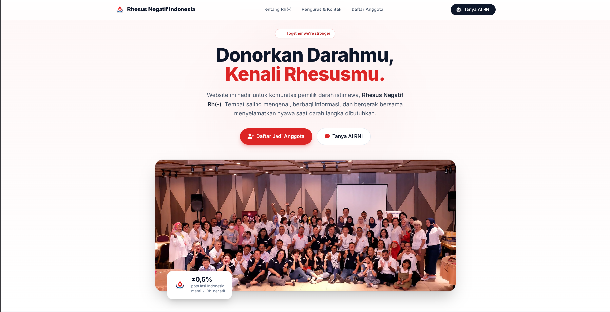
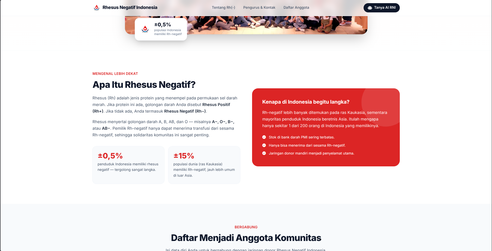
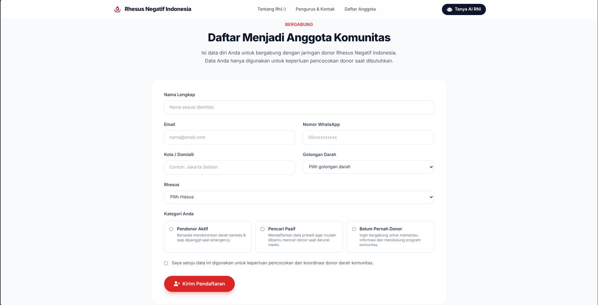
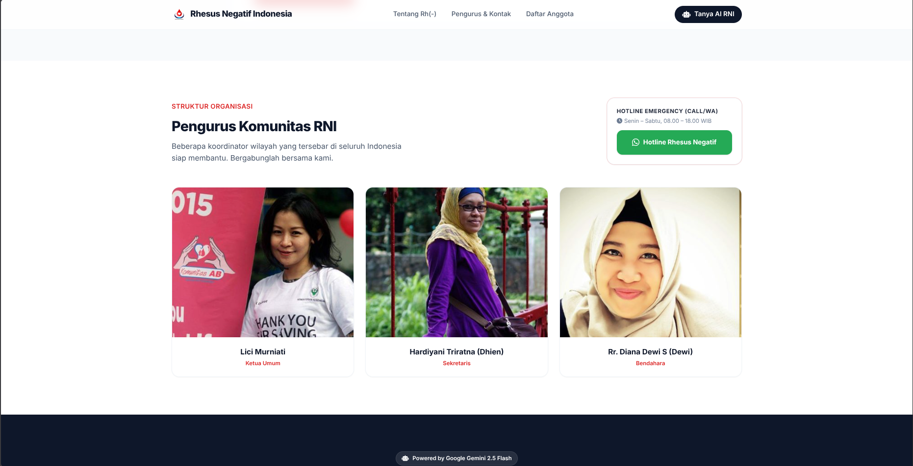
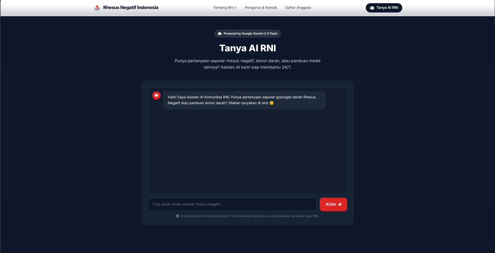
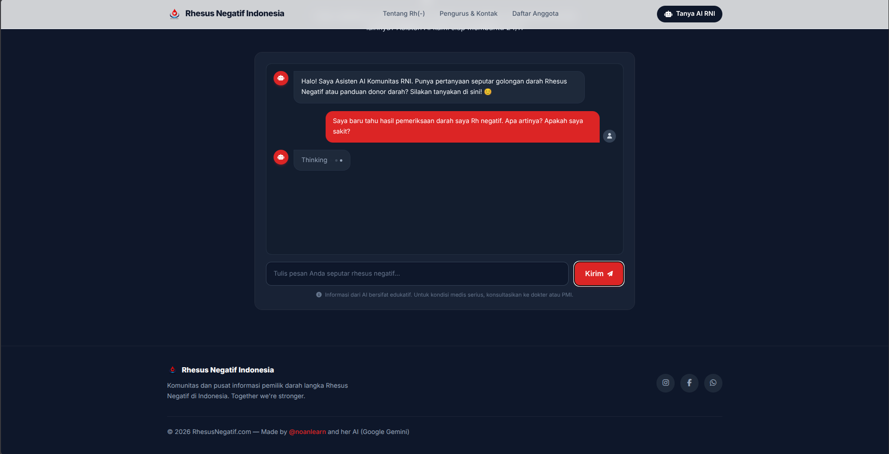
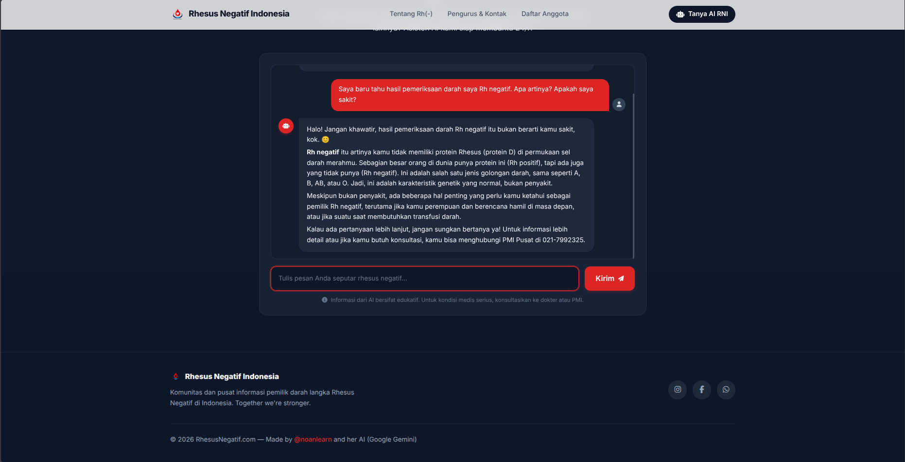

# 🩸 RNI Gemini Chatbot

Final project for **"AI Productivity and AI API Integration for Developers"** — Hacktiv8 × AVPN × Google.org × Asian Development Bank.

An AI-powered educational chatbot for the Rhesus Negative Indonesia community, built on top of a redesigned landing page of [rhesusnegatif.com](https://rhesusnegatif.com).

---

## 📸 Screenshots

| | |
|---|---|
|  |  |
|  |  |
|  |  |
|  |

---

## 📋 Project Background

**Use case:** Education Bot — raising awareness about Rhesus Negative blood type in Indonesia, a topic critical for maternal health and transfusion safety yet still widely underrepresented.

**Creative parameters applied:**
- Warm, friendly, non-intimidating tone tailored for general Indonesian audience
- Domain-specific knowledge: Rh-negative, blood types, blood donation, PMI
- Multi-turn conversation history sent on each request as a memory feature
- Markdown rendering in the chat UI for cleaner, more readable AI responses

---

## 🤖 AI Configuration

Model: **Gemini 2.5 Flash** via `@google/genai` SDK

| Parameter | Value | Reason |
|---|---|---|
| `temperature` | `0.3` | Low — medical content needs consistency over creativity |
| `topK` | `40` | Limits candidates to the top 40 tokens per generation step |
| `topP` | `0.85` | Only tokens within 85% cumulative probability are sampled — reduces hallucination |
| `systemInstruction` | custom | Defines AI persona, domain boundary, response format, and tone |
| `tools` | googleSearch: {} | Grounding Google Search for updated information |

---

## 📦 Dependencies

```json
"dependencies": {
  "@google/genai": "^2.10.0",
  "cors": "^2.8.5",
  "dotenv": "^16.0.0",
  "express": "^4.18.0",
  "multer": "^1.4.5"
}
```

**Frontend (CDN):**
- [Tailwind CSS](https://tailwindcss.com) — utility-first styling
- [marked.js](https://marked.js.org) — renders markdown from AI responses
- [AOS](https://michalsnik.github.io/aos/) — scroll-triggered animations
- [Font Awesome](https://fontawesome.com) — icons

---

## 🚀 Getting Started

```bash
git clone https://github.com/noanlearn/rni-gemini-chatbot.git
cd rni-gemini-chatbot
npm install
cp .env.example .env   # fill in your GEMINI_API_KEY
node index.js          # → http://localhost:3000
```

---

*Made by [@noanlearn](https://github.com/noanlearn) and her AI (Google Gemini) 🤖*
